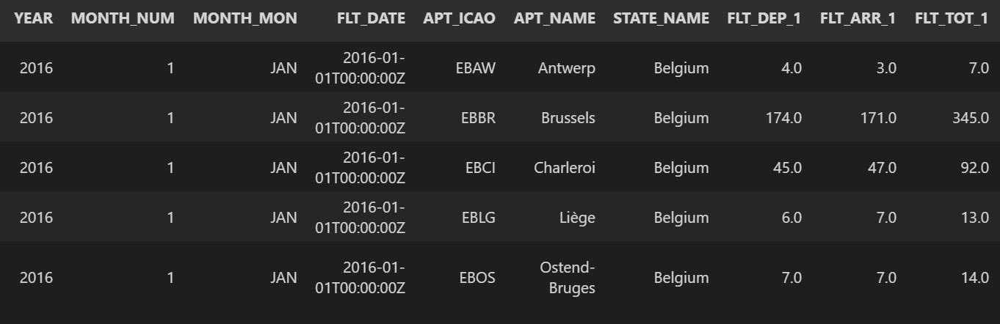
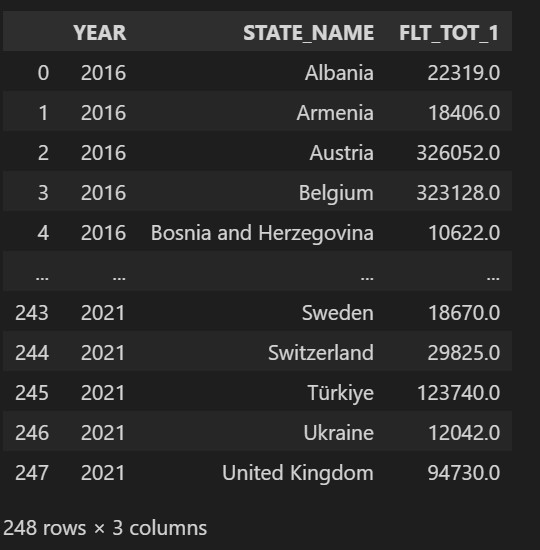
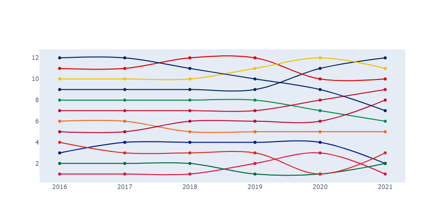

I looked far and wide to find a good way to build a bump chart like the one in this [tweet](https://twitter.com/steodosescu/status/1549065989630832642) in Python. After finding basically nothing except for a page in [Altair docs](https://altair-viz.github.io/gallery/bump_chart.html) about Bump Charts, I (reluctantly) decided to roll my own version of the tweet. While it did not reach the expected highs of that tweet, I am pleased with the end result and its easily modifiable and extensible.

The data I am using is the flights arrival and departure info available [here](https://raw.githubusercontent.com/rfordatascience/tidytuesday/master/data/2022/2022-07-12/flights.csv). Replace this with your own when working on your data.

```py
# Lets get all the imports in place
import pandas as pd
import plotly.graph_objects as go
import numpy as np
```

```py
data = pd.read_csv("flights.csv")
data.head()
```


Here we are trying to arange countries by the amount of air traffic across years. Let's build that information by grouping by the `STATE_NAME,YEAR` variables and then adding total flight count(`FLT_TOT_1`).
```py
country_flights_by_year = (
    data[["YEAR", "STATE_NAME", "FLT_TOT_1"]]
    .groupby(by=["YEAR", "STATE_NAME"])
    .sum()
    .reset_index()
)
country_flights_by_year
```


I am going to build an extra column to use as proxy for rank and the X-axis of the chart as well
```python
x = country_rank.YEAR.unique()
country_dict = {}
country_rank["POSITION"] = np.stack([range(1, 13) for _ in range(6)], axis=0).ravel()
```

The next bit here is important. A bumpchart essentially represents the position of each category w.r.t. to others. To do that obviously its needs the said position. We build the same in this section. This code will differ for each chart. Its possible to generalize this but I am not going to do that here.
```python
for grp_name, grp in country_rank.groupby("STATE_NAME"):
    country_position = [13 - i for i in grp.POSITION]
    if len(country_position) > 2:
        country_dict[grp_name] = country_position
country_dict["Poland"].insert(0, 1)
country_dict["Portugal"].insert(3, 1)
```
And finally we use this `dict` to plot the chart.
```py
fig = go.Figure()

for country, position in country_dict.items():
    fig.add_trace(
        go.Scatter(
            x=x,
            y=position,
            line_shape="spline",
            name=country,
        )
    )
fig.update_traces(hoverinfo="text+name", mode="lines+markers")
fig.update_layout(showlegend=False)
fig.update_xaxes(showgrid=False,zeroline=False)
fig.update_yaxes(showgrid=False,zeroline=False)
fig.show()

```

And here's the chart!


I think this looks good for now! Its a clean chart that we can extend for our uses later!
> Thanks to [Stephen Teodosescu](https://twitter.com/steodosescu) for this awesome chart.