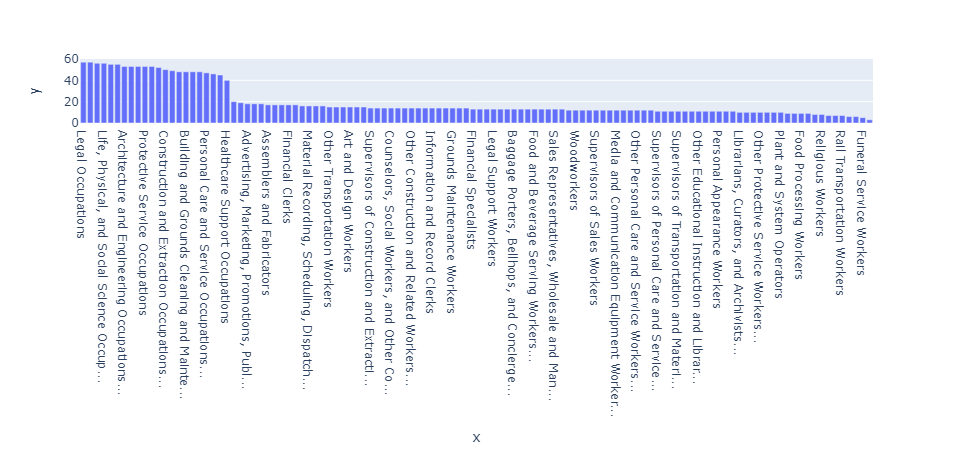

This is a way to do replicate seaborn `countplot` functionality in Plotly. 
```python
import plotly.express as px

def countplot(dataset, column, log_y=False):
    fig = px.bar(
        x=dataset[column].value_counts().index,
        y=dataset[column].value_counts(),
        log_y=log_y,
    )
    fig.data[0].x = [
        f"{xtickval[:40]}..." if len(xtickval) > 30 else xtickval
        for xtickval in fig.data[0].x
    ]

    return fig

``` 
This is the all the code you need for countplot
```python
countplot(dataset,column="OCC_TITLE").show()
```
