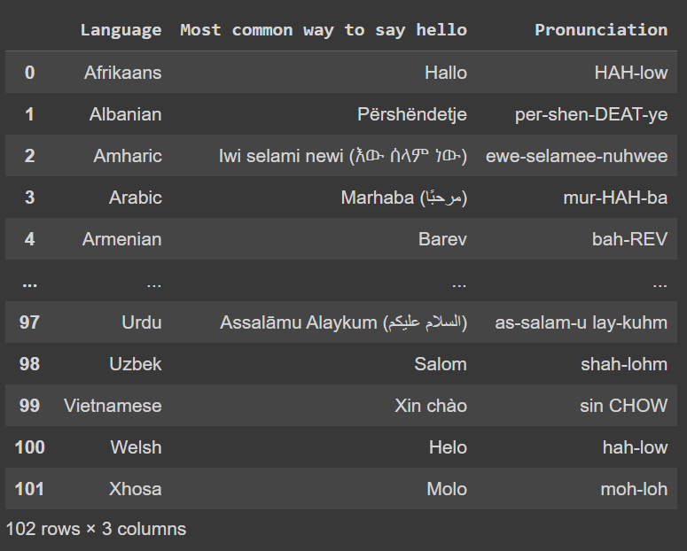

I wanted to quickly extract a table from a webpage. And I didn't want to go through the using `beautiful_soup` or `scrapy` to do that. While I was looking for something simple I found a gem of a function to do that.

I want to extract the list of hellos in different languages from this [page](https://www.berlitz.com/blog/hello-different-languages). Let's go ahead and import pandas.

```py
import pandas as pd
```

We can now use the `read_html` function from pandas like so
```python
tables  = pd.read_csv("https://www.berlitz.com/blog/hello-different-languages")
```

The languages table is the first table in the page. So we can index it 
```py
tables[0]
```


And that's it. A really quick way to extract something that's actually not quite this easy otherwise.
