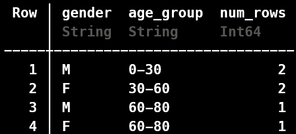

While doing any EDA or exploratory activity, you often need to groupby a certain column(s) and then do a simple count over them. This is how you'd do it in Julia

Let's say you have a dataset like so
```julia
using DataFrames
df = DataFrame(
    age_group=["0-30","30-60","60-80","30-60","0-30","60-80"],
    gender=["M","F","M","F","M","F"]
)
```

Say you want to count the population first splitting by gender and then by age. Maybe as a further input for a stacked-bar chart. First you need to do the groupby:
```julia
gdf = groupby(df,[:gender,:age_group])
```

Now that we have the individual groups we can just use the `nrows` function to count the number of rows in each group.
```julia
combine(gdf,nrow => :num_rows)
```



