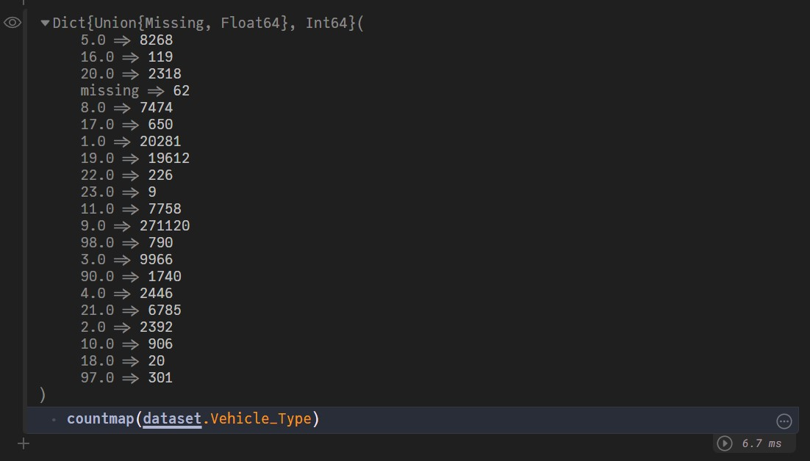

This is a simple way to do replicate pandas `value_counts` functionality in Julia. 
For the purpose of this example I am using [Road Safety Dataset](https://www.openml.org/d/42803) in OpenML. You'll need the `StatsBase` and `DataFrames` packages for the same.
```julia
using ARFFFiles
using DataFrames
using StatsBase

# Lets load the dataset here as well
dataset = ARFFFiles.load(DataFrame, "roadsafety.arff")
``` 

To do value counts on a column use this
```julia
# Replace Vehicle_Type by whatever column name
countmap(dataset.Vehicle_Type)
```


To apply over a full `DataFrame` use
```julia
countmap.(eachcol(dataset))
```

Kinda hard to read output so not gonna paste here